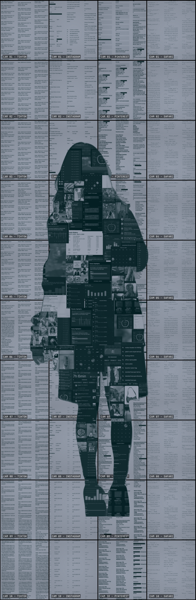

# **Title: I-Am-Data**
### *Date: 2025-04-21*
### *Author: Isabelle Viray*
### *Issue: Issue 3*
### *Tags: self-portrait, digital art, data surveillance, privacy, identity*
### *Citation: Isabelle Viray, *I-Am-Data*, 2025, digital collage, GitHub, https://ivirayy.github.io/I-Am-Data/*
### *Bio: Isabelle Viray (she/her) is a Culture and Technology Studies student with a minor in Media and Cinema Studies. Driven by a passion for visual storytelling, design, and the digital humanities, she spends her practice finding artistic ways to connect with diverse communities.*

## Abstract
*I-am-Data* is a digitized self-portrait collage displayed on an HTML-based page. This piece explores identity and expression through various levels of data collection, from self-tracking to passive surveillance. Reflecting on the relationship between the online self and the platforms, interfaces, and applications that help shape it, *I-Am-Data* critiques methods used to categorize and monitor users. By visualizing these dynamics, this self-portrait questions the sense of self when defined by data.

### **Click [here](https://ivslibrary.wordpress.com/2025/04/21/i-am-data-a-self-portrait/) for the blog post!**

*Full artwork as is:*

# **CTRL+ALT+DH - A Byte of Creativity**
# -Student Journal Submission Review-

